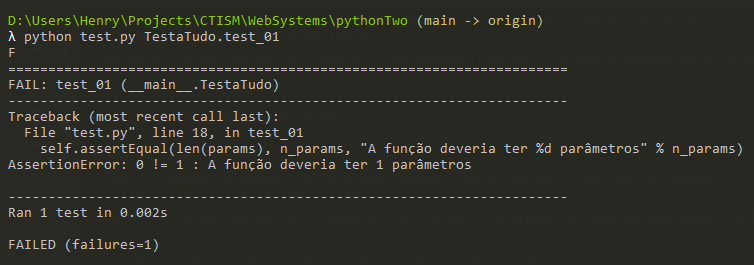
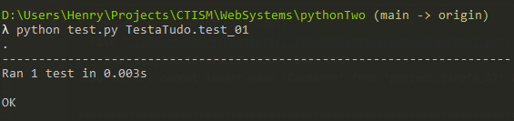

## Como usar esse repositório

Para cada uma das questões abaixo, existe um script correspondente na pasta [project](project), com uma função pré-definida.
Modifique esta função para resolver a questão. Substitua a instrução `raise NotImplementedError('ainda não implementado')` 
pelo código que você deve desenvolver para resolver o exercício.

Talvez seja necessário modificar a assinatura de uma função para resolver um exercício. Por exemplo, se a função é 
originalmente

```python
def soma():
    pass
``` 

mas o exercício diz que ela precisa somar dois números, então você precisará adicionar estes dois números como parâmetro
para a função:

```python
def soma(a, b):
    pass
```

O mesmo é válido para o retorno das funções. Se o exercício pede para a função retornar algo, não hesite em adicionar uma
instrução de retorno:

```python
def soma(a, b):
    return a + b
```

Cada script também possui uma função `main`. Você pode modificar essa função `main` sem problemas para testar seu código.

Para invocar seu script pela linha de comando, basta abrir o Prompt de Comando do seu computador, navegar até a pasta do 
projeto, e digitar, por exemplo

```bash
python tarefa_01.py
```

Para testar se **apenas uma** das suas questões está correta, rode a seguinte instrução pela linha de comando:

```bash
python test.py TestaTudo.test_01
```

Com isso, apenas o teste da tarefa 1 será rodado. Para rodar todos os testes, execute

```
python test.py
```

A saída deste script deve ser quantas questões foram corretamente respondidas. Se houveram erros, este script irá mostrar.
Por exemplo:



É possível ver que o erro ocorreu porque a função tarefa_1 deveria possuir um parâmetro, mas não possui nenhum. Fique 
atento à mensagem de erro, pois ela vai lhe dizer o que está errado!

Quando tudo tiver sido corretamente resolvido, a saída ficará assim: 



**Não modifique o script `test.py`, pois isso pode impedi-lo de ver se os exercícios foram corretamente resolvidos.**

PS: Obviamente eu não usarei este script em particular para corrigir os trabalhos, vou usar a cópia que tenho no meu 
computador. Logo, um motivo a mais para não mexer nele!

## Como entregar essa lista

Você não precisa me entregar nada. Eu já tenho acesso ao seu repositório /mwahaha

**CONTUDO**, não esqueça de enviar as suas modificações para o repositório remoto do Github:

```
git add .
git commit -m "resolvi o primeiro exercício"
git push origin main
```

**VERIFIQUE** o seu repositório remoto para ter certeza que as modificações estão lá!

## Nota

A nota é `<número de exercícios respondidos corretamente>/<número de exercícios no total> * 10` 

Exemplo:

Respondeu 10 exercícios corretamente de 14:

```
(10/14) * 10 = 7.1 
```

--- 

## Instruções para os exercícios

1. Essa lista é difícil. Sério, ela é muito difícil. Se você só conseguir fazer UM exercício da lista, considere-se 
   vitorioso!
2. A lista é em dupla. Isso é pra melhor dividir as tarefas entre você e seu colega, ok? Portanto sem colar dos 
   coleguinhas de fora da dupla. Se eu pegar alguma cola, é zero pra todo mundo!
3. Se a lista estiver mais que difícil (por exemplo, se ela estiver IMPOSSÍVEL de fazer), dê uma olhada no material, 
   principalmente nos vídeos do Youtube. Eu cobri **todos** os tópicos dessa lista em vídeo.

# Exercícios

 0. Escreva uma função que peça dois números e retorne a soma. **[Resolvido]** 
  
 1. (laços) Escreva uma função que, dada um número `N` por parâmetro, retorna uma lista `NxN` de zeros.
    
    Exemplo com N=3:
    
    Entrada:
    
    ```python
    matriz = tarefa_1(3)
    print(matriz)
    ```
    
    Saída: 
    
    ```
    [[0, 0, 0], [0, 0, 0], [0, 0, 0]]
    ```
    
 2. (listas, strings, exceções) Crie uma função que, dada uma string que contém **números separados por caracteres**, 
    converta esta string em uma lista, e a retorne.
    
    Exemplos:
    
    * `1,2,3,4` -> `[1,2,3,4]`
    * `1;2;3;4` -> `[1,2,3,4]`
    * `1a2b3c4` -> `[1,2,3,4]`
    * `-1.3|+5.4` -> `[-1.3,5.4]`

 3. (dicionários) Crie uma função que, dado um dicionário e um número, decida se aquele número está contido no dicionário 
    como valor.
 4. (funções, strings, laços) A função `log` diz quantas vezes um número pode ser dividido por outro. Por exemplo, `log_2(8)` 
    (lê-se "log de 8 na base 2") é 3, pois 8 pode ser dividido 3 vezes por 2 antes de se chegar ao número 1 (8/2 = 4/2 = 
    2/2 = 1, 3 divisões). Sem utilizar nenhuma biblioteca externa, crie uma função com laço de iteração (`for` ou `while`) 
    para calcular `log_2(x)`, onde `x` é um número **inteiro** a ser passado para a função como parâmetro. A função deve 
    também retornar um número **inteiro** (por exemplo, `log_2(3.14) = 1`; arredonde para baixo).
 5. (funções, strings, recursão) Sem utilizar nenhuma biblioteca externa, e sem utilizar nenhum tipo de laço (`for` ou 
    `while`), crie uma função para calcular `log_2(x)`, onde `x` é um número **inteiro** a ser passado para a função 
    como parâmetro. A função deve também retornar um número **inteiro** (por exemplo, `log_2(3.14) = 1`; arredonde para baixo).
 6. (classes, exceções) Crie uma classe `Animal`. Esta classe deve possuir as seguintes características:
    * Três atributos: `peso`, `altura`, e `cor`
    * O construtor da classe (função `__init__`) deve ter `peso`, `altura`, e `cor` como parâmetros, e definir o `peso`, 
      `altura`, e `cor` do animal com base nos valores dos parâmetros passados
    * Possuir dois métodos: `respira` e `se_comunica`. Estes dois métodos devem lançar uma exceção do tipo `NotImplementedError`,
      quando utilizados.
 7. (classes, herança) Crie uma classe `Cachorro`, que deve herdar a classe `Animal` do exercício anterior, e sobrescrever
    os métodos `respira` e `se_comunica`. O método `respira` deve retornar a string `'*respirando*'`, enquanto o
    método `se_comunica` deve retornar a string `'au au!'`.
    * Não se esqueça de copiar o código que define a classe `Animal` para o arquivo deste exercício!
 8. (classes, sobrecarga de operadores) Sobrescreva o método `__add__` da classe `Cachorro`, elaborado no exercício 
    anterior. Este método possui a assinatura `__add__(self, other)`, onde `other` é outro objeto da classe `Cachorro`
    (faça checagem de tipo). Este método deve retornar um novo cachorrinho, que possuirá a média do `peso` e `altura`
    dos cachorros `self` e `other`, e uma nova pelagem com base na tabela abaixo.
    * Não se esqueça de copiar o código que define a classe `Animal` e `Cachorro` para o arquivo deste exercício!    

    Tabela de Pelagem
    
    | cachorro \#1  | cachorro \#2 | pelagem do filhote |
    |--------------:|-------------:|-------------------:|
    |         preto |        preto |              preto |
    |        branco |       branco |             branco |
    |      caramelo |     caramelo |           caramelo |
    |         preto |       branco |            malhado |
    |      caramelo |       branco |            malhado |
    |        branco |      malhado |            malhado |
    |         preto |      malhado |            malhado |
    |      caramelo |      malhado |            malhado |

 9. (contextos, entrada e saída, listas) Considere a tabela do exercício 8. Utilizando contextos, escreva esta tabela
    para um arquivo do tipo `.csv`, de nome `tipos_de_pelo.csv`. Separe as colunas por vírgula. 
10. (contextos, entrada e saída, módulos, dicionários) Considere o arquivo [exemplo.json](project/exemplo.json). 
    Utilizando a biblioteca [json](https://docs.python.org/3/library/json.html), leia-o para um dicionário, e instancie
    cada uma das cachorras do arquivo para um objeto da classe `Cachorro` (definido nos exercícios anteriores). Retorne
    uma lista das cachorras instanciadas.

## Créditos

Sem créditos. Tirei tudo da minha cabeça 🤯
